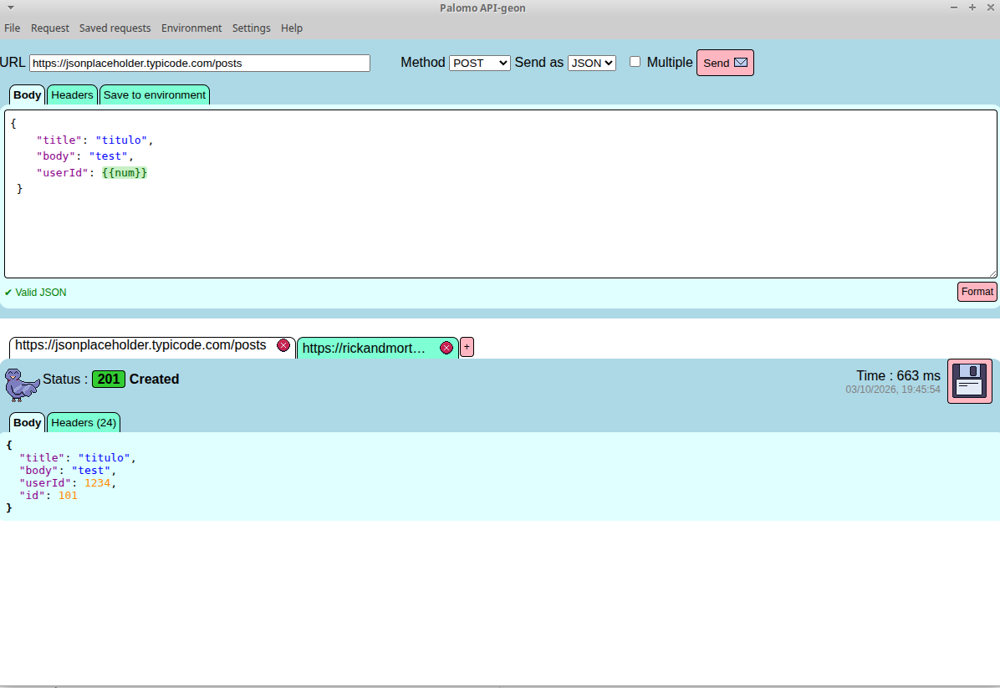
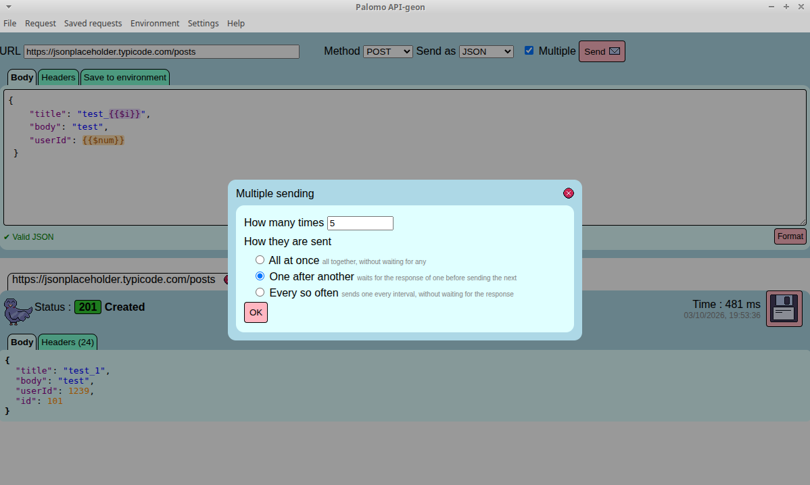
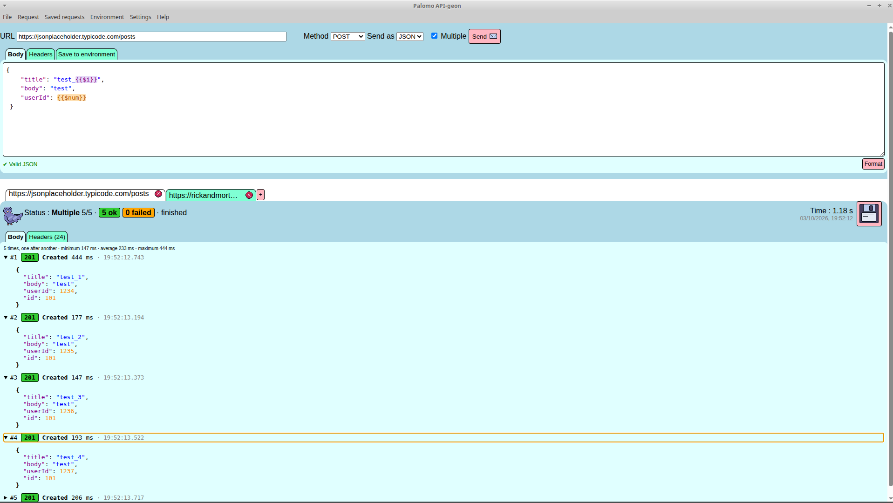
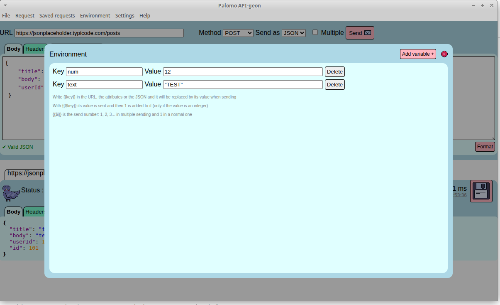
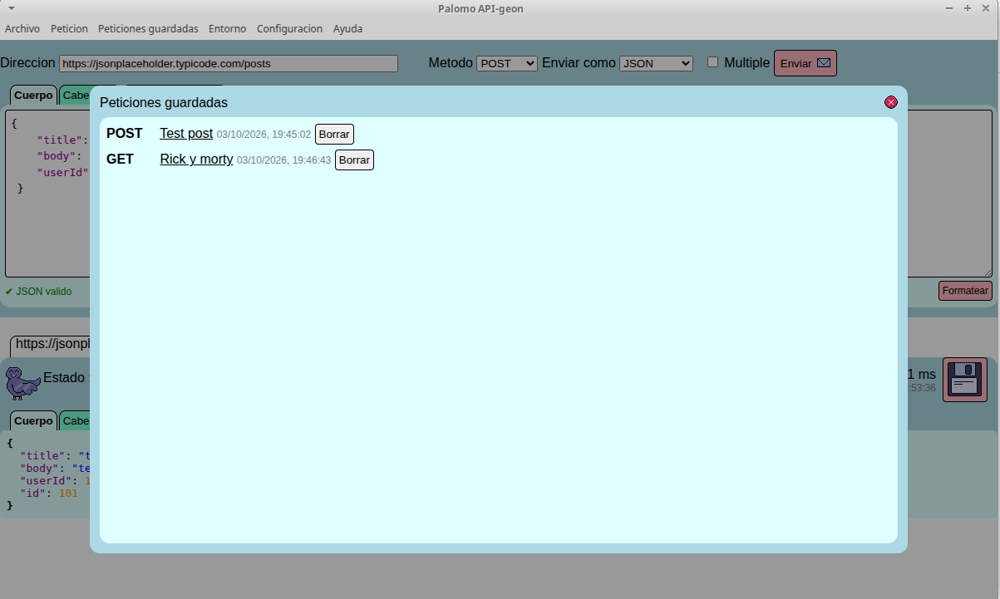
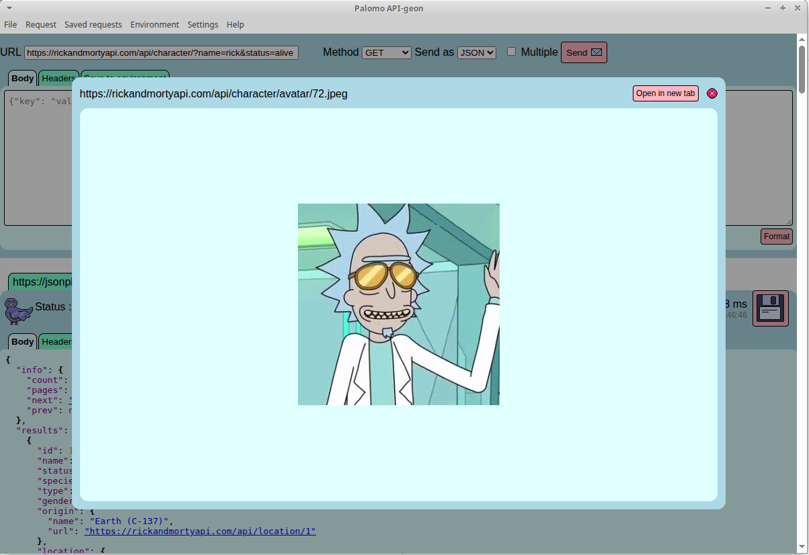

# Palomo API-geon


Cliente de escritorio sencillo para probar APIs HTTP, hecho con Electron.

## Descargar

**[⬇️ Descargar la última versión](https://github.com/tonyponyy/palomo/releases/latest)**

| Sistema | Archivo |
|---|---|
| Linux | `Palomo-API-geon-x.x.x.AppImage` (dale permiso de ejecución y ábrelo) o `palomo_x.x.x_amd64.deb` (Ubuntu / Debian) |
| Windows | `Palomo-API-geon-x.x.x-windows-portable.zip` (no necesita instalarse: descomprímelo y abre `Palomo API-geon.exe`) |

> En Windows puede salir el aviso "Windows protegió su PC" porque el programa no está firmado.
> Pulsa en **Más información → Ejecutar de todas formas**.

## Probar en el navegador

**[▶️ Probar Palomo API-geon online](https://tonyponyy.github.io/palomo/)**, sin instalar nada.

> ⚠️ La versión web es para echar un vistazo y **es posible que haya cosas que no funcionen**.
> El navegador solo deja hacer peticiones a las APIs que lo permiten (CORS), hay cabeceras
> que no se pueden cambiar, y lo que guardes se queda solo en ese navegador.
> Para usarlo de verdad, mejor descarga la versión de escritorio.

## Capturas

### Petición y respuesta



La pantalla principal. Arriba se escribe la petición: dirección, método (GET, POST, PUT…),
formato de envío y el cuerpo en JSON, que se valida mientras escribes (*✔ Valid JSON*) y se
puede formatear con un botón. Las variables del entorno como `{{num}}` se resaltan en verde.
Abajo está la respuesta: código de estado, tiempo que ha tardado, cuerpo con colores y
cabeceras. Cada petición va en su propia pestaña, y con el disquete se guarda para más tarde.

### Envío múltiple



Marcando **Multiple** se puede lanzar la misma petición varias veces: todas a la vez, una
detrás de otra (esperando cada respuesta) o cada cierto tiempo.



El resultado del envío múltiple: cuántas han ido bien y cuántas han fallado, los tiempos mínimo,
medio y máximo, y cada respuesta por separado. Aquí `{{$i}}` se cambia por el número de envío
(`test_1`, `test_2`…) y `{{$num}}` suma 1 en cada petición (`1234`, `1235`…).

### Entorno



Las variables del entorno. Cualquier `{{clave}}` que escribas en la dirección, las cabeceras o
el JSON se cambia por su valor al enviar. Con `{{$clave}}` además se le suma 1 después de cada
envío, útil para ids que no se pueden repetir. Desde la pestaña *Save to environment* también
se pueden guardar aquí valores sacados de una respuesta, como un token.

### Peticiones guardadas



Las peticiones que has guardado, con su método y la fecha. Al pulsar una se abre en una
pestaña nueva tal y como la dejaste. La interfaz está en 7 idiomas (aquí en español).

### Ver imágenes y páginas de la respuesta



Las direcciones que aparecen en una respuesta JSON se pueden pulsar para verlas sin salir
del programa, ya sean imágenes o páginas web, o abrirlas en una pestaña del navegador.

## Funcionalidades

- Peticiones GET, POST, PUT, DELETE… con cuerpo JSON y cabeceras personalizadas
- Pestañas, y peticiones guardadas para reutilizarlas
- Variables de entorno: escribe `{{clave}}` en la URL, las cabeceras o el JSON
  - `{{$clave}}` envía el valor y después le suma 1
  - `{{$i}}` es el número de envío
- Extraer valores de la respuesta al entorno
- Envío múltiple: en paralelo, en secuencia o a intervalos
- Disponible en español, català, English, Deutsch, русский, 中文 y 日本語

## Ejecutar desde el código

Necesitas [Node.js](https://nodejs.org/) 18 o superior.

```bash
npm install
npm start
```

## Compilar

```bash
npm run dist       # AppImage y .deb (Linux)
npm run appimage   # solo AppImage
npm run win        # instalador .exe y .zip portable (Windows)
```

O todo de una vez (AppImage, .deb, .exe y .zip) con `scripts/compilar.sh`.

Para compilar para Windows desde Linux hace falta Wine (`sudo apt install wine`).

Los paquetes se generan en `dist/`. La versión se toma de la constante `VERSION`
de `src/palomo.html` y se copia a `package.json` antes de compilar.

## Estructura

```
├── build/            recursos para electron-builder (iconos)
├── capturas/         capturas de pantalla del README
├── index.html        redirige a la app (para GitHub Pages)
├── scripts/          utilidades de compilación
└── src/
    ├── main.js       proceso principal de Electron
    ├── preload.js    puente entre Electron y la página
    ├── palomo.html   interfaz
    ├── css/
    ├── img/
    └── js/
        └── idiomas/  traducciones
```

## Licencia

[ISC](LICENSE)
